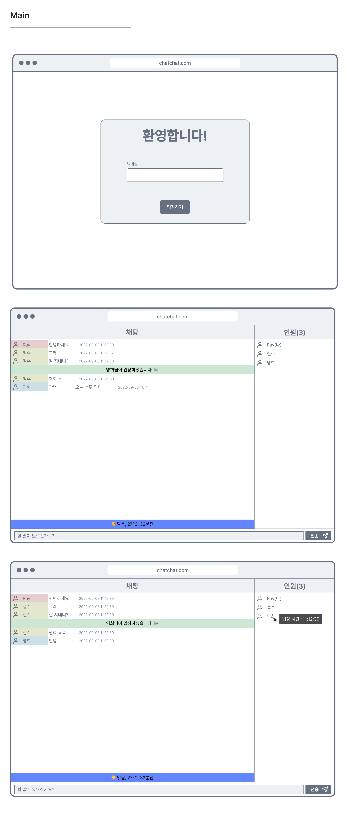

# Chat Chat

## 개요 및 요구사항

`Chat Chat`은 간단한 채팅 클라이언트 웹앱이다. 과제는 아래의 [와이어 프레임](#디자인-와이어프레임)을 참조하여 동일한 페이지를 만들어야한다. 와이어 프레임을 제공하지만 와이어 프레임을 해치지 않는 선에서 세부적인 구현과 디자인은 구현 담당자에게 일임한다.

해당 과제는 **js를 이용한 통신, 비동기 프로그래밍, 그리고 컴포넌트 라이브러리를** 활용한 웹앱 구현에 그 목적이 있다.

또한, 사내에서 사용하는 기술 스택을 연습하기 위해 [Next.js](https://nextjs.org/)와 [tailwindcss](https://tailwindcss.com/)를 사용한다.

## 참조할만한 사이트

- [Nextjs](https://nextjs.org/) - React 앱 개발에 필요한 모든 걸 지원하는 프레임워크
- [tailwindcss](https://tailwindcss.com/) - 유틸리티 CSS 프레임워크
- [CSS Module](https://github.com/css-modules/css-modules) - CSS에 스코프를 추가해주는 CSS 파일(\*.module.css)
- [CSS Utility Classes and "Separation of Concerns"](https://adamwathan.me/css-utility-classes-and-separation-of-concerns/) - `tailwindcss` 개발자 `Adam Wathan`이 쓴 CSS의 재사용성에 대한 고찰과 Utility CSS에 대한 소개글. 재사용성에 대해 좋은 인사이트를 얻을 수 있는 글이다.

## 프로젝트 진행

담당자가 생성해주는 새 레포지토리에서 개발한다. 레포지토리 이름은 fe-ojt-[이름]-chatchat 형식이며, 이름이 김철수면 fe-ojt-kcs-chatchat으로 작성된다.

소스 관리는 GitHub Flow 워크플로우로 진행하고 작업이 완료된 모든 브랜치는 담당자의 허가하에 머지 된다.

## 채팅 서버 연동 인터페이스

[ts-chat-server](https://github.com/malgn/fe-ojt-ts-chat-server) 참조

## 날씨 데이터

[AccuWeather](https://developer.accuweather.com/) 참조

## 디자인 와이어프레임

